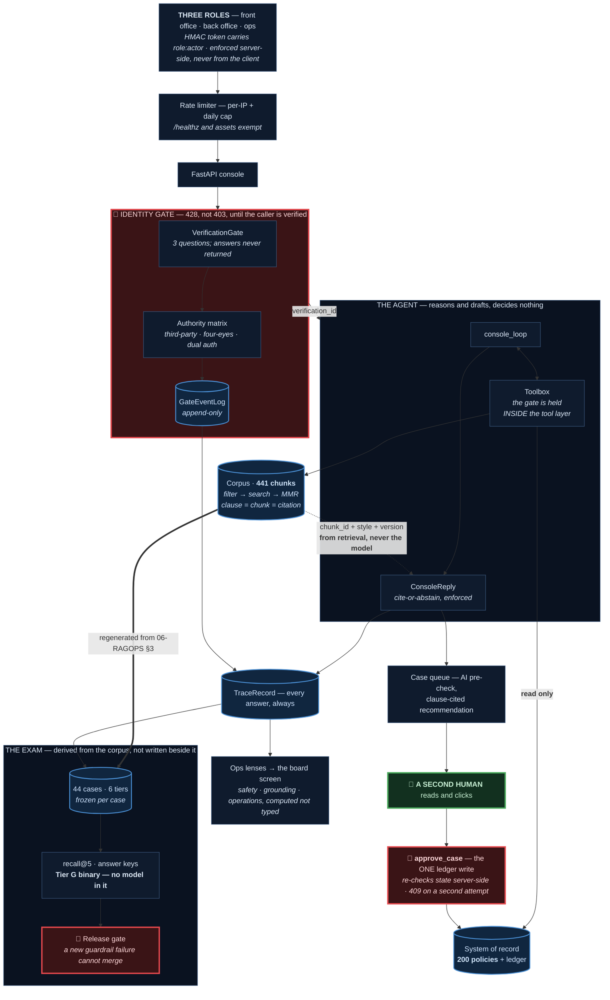

# CalmLine

[](https://github.com/shayandas862-hub/calmline/actions/workflows/tests.yml)

**This is an independent educational portfolio project.** It was designed, built
and published by me in my own time, using my own equipment and accounts. It is
not affiliated with, commissioned by, endorsed by, or deployed by any employer,
client or insurer. Aldercrest Life Assurance plc is fictional; every person,
policy and transaction in this repository is synthetic and generated by code
included here. See **[Legal and data notice](#legal-and-data-notice)** below.

> A governed operational console for insurance administration, worked by a
> tool-using AI agent that is **measured, never trusted**. The AI checks and
> drafts; named humans decide and move money. Headline metric: **safety
> accuracy** — how reliably the system withholds (refuses to answer, or blocks
> an action) when withholding is the right call.

**Status:** the **v4 build is complete, and v4.5 "the prequel" has built the
world** (phases 1–5): **200 policies with real financial mathematics** — the
bond's 5% allowance tested at policy-year end, the MPAA with exactly one
trigger, with-profits that smooths instead of falling — lived by **299 invented
people** drawn from officially reserved ranges, through **8,547 ledger
movements** and **1,882 pieces of operational prose** — contact notes and case
narratives, written by a language model to a committed brief. The numbers are
generated deterministically; all of it is validated through the same rulebook
the console enforces, committed as reviewable files, then **loaded into
Postgres one policy per transaction and verified to the penny against the
files — 13,861 rows**. A load killed mid-flight leaves every
committed policy whole; that is proved by killing one, not by reasoning. Next:
phases 6–7 put that history on all three desks; v5 then wires the console's
live reads and writes.

The corpus is the Aldercrest Life knowledge base (`data/kb/` — 7 documents, 441
metadata-tagged chunks, of which **438 are indexed**: the three `sample_record`
chunks are deliberately never embedded, per D-CL-033; operating standards
fictional, legal/regulatory content real and source-linked), and the console is
built around two authoritative
stores: a deterministic **system of record** for every fact and figure, and
filtered **retrieval** for every rule.
One page of design: **[the diagram below](#one-page-of-design)**.

**Numbers are published only once they are real** — the ones below came from a
live 44-case run, and the unflattering ones are here too.

- 🔗 **Live demo:** _(deploying — the URL lands here)_

---

## What it is

Customer-service staff sign in by role and work from one screen each:

- **Front office** — search by policy number or holder name, open the full
  record: holder, policy, live balance, and the append-only transaction ledger.
  Verification is a **held-check panel**: the handler asks, ticks what the
  caller states, and the server enforces three-of-four before anything is
  disclosed — a caller who cannot answer is *recorded* as a failed attempt,
  never silently abandoned. Ask the CalmLine agent a question; it picks a tool
  (policy record, transaction history, or clause retrieval) and answers **with
  a clause citation** — or visibly refuses. If the caller wants to act, the
  handler raises a case.
- **Back office** — a priority-ranked queue with SLA timers. Each case carries
  an AI **compliance pre-check** whose every line cites a clause, and a
  proceed / do-not-proceed recommendation. Only a human clicking **Approve**
  commits the money movement to the ledger — a `do_not_proceed` case cannot be
  approved at all, and the AI's money tool is *structurally* unable to write.
- **Ops** — three read-only lenses (compliance & oversight, operations &
  throughput, system & data health) computed live from real state, including a
  ledger self-check that recomputes every balance from its own history.

Money is integer pence end-to-end; the ledger is append-only; roles are
enforced server-side.

## One page of design

Two things are marked **red**: the single place money moves, and the gate that
stands in front of every disclosure. Everything else is arrows.



### The four claims this diagram makes

**1 · There is exactly one ledger write.** `approve_case` in
`src/casework/approval.py`. No tool the agent can call reaches it; the agent's
`record_transaction` returns a *proposal*. The endpoint re-checks the case state
server-side, so a second approval is refused with a **409** rather than a
disabled button.

**2 · The gate is inside the tool layer, not in front of it.** A record tool
without a live verification refuses *itself*. That is why an agent that decides
to be helpful cannot route around it, and why the four disclosure endpoints
return **428** rather than empty data.

**3 · Citations come from retrieval, never from the model.** Chunk id, citation
style and version all travel out of the retriever. If the model cites something
retrieval did not return, the grounding invariant refuses the whole answer — it
did so twice in the recorded 44-case run.

**4 · The safety metric has no model in it.** Tier G passes only if the reply
*structurally* withheld — abstained, or raised a guardrail event. The LLM judge
grades answer-key coverage and nothing that can block a release. A safety verdict
a model can be talked out of is not a safety verdict.

## Run it locally (offline, no keys)

```bash
python3 -m venv .venv
./.venv/bin/pip install -e ".[dev]"
./.venv/bin/python scripts/run_console.py   # → http://127.0.0.1:8001
```

Sign in as any role and drive the whole flow: search a policy (a number or a
holder-name fragment), tick the verification checks, ask the agent, raise a
case, approve it in the back office, and watch the ledger move — the one
human-gated write in the system.

```bash
./.venv/bin/pytest -q -m "not integration"  # the test suite (what CI runs)
```

**The two commands worth running first**, both free and offline — no key, no
database, no deploy:

```bash
./.venv/bin/python scripts/run_evals.py --replay   # the six-tier scorecard, from committed outputs
./.venv/bin/python scripts/eval_gate.py baseline   # the release gate, on that scorecard
```

## How it is measured

- A **rubric** ([`rubric/rubric.md`](rubric/rubric.md)) drawn from public FCA
  guidance — 17 points, 13 scored programmatically, 4 by an LLM judge that is
  itself validated against human hand-grades.
- A **golden eval set of 44 cases** on the knowledge base's six-tier design
  (retrieval 9 · multi-hop 9 · cross-document 6 · temporal 4 · guardrail 8 ·
  operational 8). It is **derived from the knowledge base, not written beside
  it** — a script regenerates it from the KB's own tables, and CI fails if the
  two have diverged. Every expected chunk is validated against the corpus
  parser at load time, so the set cannot rot against the documents it grades.
- **Tier G guardrail cases are binary**, and that is **safety accuracy under
  another name** — the same question v1 asked, made harder: a single failure
  blocks release regardless of overall score, where a rate could absorb one
  inside a good average. Withholding is judged **structurally, with no model
  involved**; a safety verdict decided by a model is one that can be talked
  out of.
- **Frozen per case, grow-only.** New cases may be added and the set re-frozen
  in a visible commit; editing or deleting a frozen case fails CI, because the
  way past a failing case must not be to reword it.
- An **eval harness** that replays cached outputs deterministically — free, no
  secrets — and a CI **release gate**, now **armed**, comparing every protected
  metric per tier to a baseline recorded from a real run. A new guardrail
  failure cannot merge.

### The recorded baseline

44 cases, `claude-haiku-4-5`, measured — **$0.56 across 179 calls**.

| | | by tier (recall@5) |
|---|---|---|
| Guardrail verdict (Tier G, binary) | **88%** | R 89% · M 78% · X 57% |
| Retrieval recall@5 | **57%** | T 88% · G 6% · O 35% |
| Answer-key coverage (LLM judge) | **71%** | |

**Tier G recall@5 is 6%, and that is the honest half of this table.** Retrieval
serves the guardrail cases worst — and the safety verdict is 88% anyway, because
when the system has not been shown the right clause it *withholds* rather than
reaching. One case (E34) still fails and is carried in the baseline by name, so
the gate reports it on every run rather than going quiet about it. A scorecard
that read 97% everywhere would be reporting a metric, not a system.

The methodology has a real limit, stated plainly rather than buried: 44 cases is
a demonstration-grade count, not a production evaluation suite.

## Connect via MCP

CalmLine's policy retrieval is also exposed as a **Model Context Protocol (MCP)
server**, so any MCP client (Claude Desktop, Claude Code, …) can call the same
cited-or-refuse lookup the agent uses — no CalmLine code required on the client.

The server ([`mcp_server/server.py`](mcp_server/server.py)) publishes one tool:

- **`policy_lookup(query, top_k=8)`** → the relevant policy clauses as citations
  (`chunk_id`, `doc`, `clause_type`, `text`), or `found: false` when nothing
  clears the relevance threshold — a retrieval-level refusal signal, so the
  client knows *not* to answer from general knowledge.

Point your MCP client at it over stdio (e.g. in `claude_desktop_config.json`):

```json
{
  "mcpServers": {
    "calmline-policy": {
      "command": "python",
      "args": ["-m", "mcp_server.server"],
      "cwd": "/absolute/path/to/calmline",
      "env": {
        "OPENAI_API_KEY": "sk-...",
        "COHERE_API_KEY": "...",
        "DATABASE_URL": "postgresql://..."
      }
    }
  }
}
```

Live retrieval needs those three read-path keys and a **seeded Supabase** (the
embeddings + clause corpus). Until that's provisioned, the server and its tool
schema are exercised by the test suite (`tests/test_mcp_server.py`) with a
stubbed lookup — zero live calls. Everything served is **synthetic** demo data.

## Development

**Environment.** Eight variables, all listed in [`.env.example`](.env.example):
six secrets (Supabase URL and service key, a Postgres connection string,
Anthropic, OpenAI, Cohere) and two model ids. Everything shown above runs
offline without any of them — they are needed only for live retrieval, the
database load, and the deploy.

**Deploy.** [`render.yaml`](render.yaml) is the deploy written down — free tier,
single instance, every secret marked `sync: false` so no value ever lives in the
file. Started with `--prod`, the console refuses to boot unless all six secrets
are present, naming every missing one in a single error before it serves a
request.

**Known, and said here rather than found later:** approved withdrawals persist
within a session but **not across a restart** — the record store is in-memory,
and the Postgres implementation is async while the console's routes are
synchronous. Nothing in `src/` closes an interaction, so a transcript of
disclosed data does not clear. Both are written up rather than worked around.

## Legal and data notice

**CalmLine and Aldercrest Life Assurance plc are fictional.** This is an
independent educational portfolio project demonstrating AI-engineering
technique. It is not a real insurer or financial-services firm; it is **not
authorised or regulated by the FCA or PRA**; it offers no insurance products
and provides no financial, legal or tax advice.

Aldercrest Life Assurance plc is fictional and is not a real insurer. **No
company of that name appears on the Companies House register**, and no
reference to any real business is intended. Any similarity to the name of any
real company is coincidental.

### The data

All people, policies, transactions and correspondence in this repository are
**synthetic, generated by code included here**. The world is built to make
accidental resemblance structurally unlikely, not merely improbable:

- **Names** are `<token> <token> <number>` from mineral, geometry and astronomy
  vocabularies with a mandatory numeric tag ("Alpha Feldspar 265") — never drawn
  from name corpora.
- **Telephone numbers** come from Ofcom's reserved drama range
  (07700 900000–900999), which is never allocated to a real subscriber.
- **Email addresses** use `example.org`, reserved by RFC 2606.
- **Postcodes** use the unallocated `ZZ` area with invented towns.
- **Operational prose** names roles, never people — enforced by a validator and
  pinned by tests.

**The people, policies and ledger movements are generated by seeded,
deterministic code with no model in the path** — `python -m world.dataset
--seed 11` reproduces them byte for byte, and no model client is constructed
anywhere in `world/`. **The 1,882 contact notes and case narratives were
written differently: by a language model in the build session**, to the
committed brief at [`world/stories/BRIEF.md`](world/stories/BRIEF.md), policy
by policy. Nothing in this repository calls a model to produce them, and
nothing can regenerate them.

Neither path was ever shown real data. The generators invent from a seed; the
prose was written from the generated world and the brief and nothing else, and
an offline validator ([`world/stories/validate.py`](world/stories/validate.py))
refuses a name-shaped string before a piece is accepted.

### The regulatory content

Regulatory and legal material is **cited from public sources by reference and
paraphrased, not reproduced**.

Material from legislation.gov.uk, gov.uk and HMRC manuals is Crown copyright and
is used under the [Open Government Licence v3.0](https://www.nationalarchives.gov.uk/doc/open-government-licence/version/3/).
Material published by the FCA (including the Handbook), the ICO, the Financial
Ombudsman Service, the FSCS and the Bank of England / PRA is the copyright of
those bodies — none of them is a Crown body — and is **referenced and
paraphrased, never reproduced**.

Rule references are given so a reader can check them at source. **They may drift
as the Handbook is amended — always check the live source before relying on any
reference here.** Nothing in this repository should be used as a compliance
reference for real work.

### The operating standards

The operating standards, service levels, escalation paths and procedures
depicted are **invented for this fiction**. They describe no real firm's
operation.

### If you are running the demo

The hosted demo, where one is published, holds only synthetic data. **Do not
enter real personal information into it.** It is a demonstration and provides
no advice.

## Licence

[MIT](LICENSE) © 2026 Shayan Das
